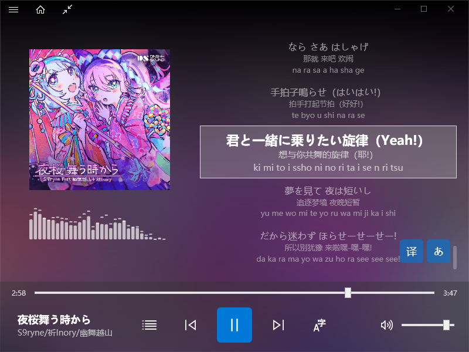

<div align="center">
  
  <h2>WpfMusicPlayer</h2>
</div>

[![zread](https://img.shields.io/badge/Ask_Zread-_.svg?style=for-the-badge&color=00b0aa&labelColor=000000&logo=data%3Aimage%2Fsvg%2Bxml%3Bbase64%2CPHN2ZyB3aWR0aD0iMTYiIGhlaWdodD0iMTYiIHZpZXdCb3g9IjAgMCAxNiAxNiIgZmlsbD0ibm9uZSIgeG1sbnM9Imh0dHA6Ly93d3cudzMub3JnLzIwMDAvc3ZnIj4KPHBhdGggZD0iTTQuOTYxNTYgMS42MDAxSDIuMjQxNTZDMS44ODgxIDEuNjAwMSAxLjYwMTU2IDEuODg2NjQgMS42MDE1NiAyLjI0MDFWNC45NjAxQzEuNjAxNTYgNS4zMTM1NiAxLjg4ODEgNS42MDAxIDIuMjQxNTYgNS42MDAxSDQuOTYxNTZDNS4zMTUwMiA1LjYwMDEgNS42MDE1NiA1LjMxMzU2IDUuNjAxNTYgNC45NjAxVjIuMjQwMUM1LjYwMTU2IDEuODg2NjQgNS4zMTUwMiAxLjYwMDEgNC45NjE1NiAxLjYwMDFaIiBmaWxsPSIjZmZmIi8%2BCjxwYXRoIGQ9Ik00Ljk2MTU2IDEwLjM5OTlIMi4yNDE1NkMxLjg4ODEgMTAuMzk5OSAxLjYwMTU2IDEwLjY4NjQgMS42MDE1NiAxMS4wMzk5VjEzLjc1OTlDMS42MDE1NiAxNC4xMTM0IDEuODg4MSAxNC4zOTk5IDIuMjQxNTYgMTQuMzk5OUg0Ljk2MTU2QzUuMzE1MDIgMTQuMzk5OSA1LjYwMTU2IDE0LjExMzQgNS42MDE1NiAxMy43NTk5VjExLjAzOTlDNS42MDE1NiAxMC42ODY0IDUuMzE1MDIgMTAuMzk5OSA0Ljk2MTU2IDEwLjM5OTlaIiBmaWxsPSIjZmZmIi8%2BCjxwYXRoIGQ9Ik0xMy43NTg0IDEuNjAwMUgxMS4wMzg0QzEwLjY4NSAxLjYwMDEgMTAuMzk4NCAxLjg4NjY0IDEwLjM5ODQgMi4yNDAxVjQuOTYwMUMxMC4zOTg0IDUuMzEzNTYgMTAuNjg1IDUuNjAwMSAxMS4wMzg0IDUuNjAwMUgxMy43NTg0QzE0LjExMTkgNS42MDAxIDE0LjM5ODQgNS4zMTM1NiAxNC4zOTg0IDQuOTYwMVYyLjI0MDFDMTQuMzk4NCAxLjg4NjY0IDE0LjExMTkgMS42MDAxIDEzLjc1ODQgMS42MDAxWiIgZmlsbD0iI2ZmZiIvPgo8cGF0aCBkPSJNNCAxMkwxMiA0TDQgMTJaIiBmaWxsPSIjZmZmIi8%2BCjxwYXRoIGQ9Ik00IDEyTDEyIDQiIHN0cm9rZT0iI2ZmZiIgc3Ryb2tlLXdpZHRoPSIxLjUiIHN0cm9rZS1saW5lY2FwPSJyb3VuZCIvPgo8L3N2Zz4K&logoColor=ffffff)](https://zread.ai/WpfMusicPlayer-Dev/WpfMusicPlayer)


[](https://github.com/trekhleb/state-of-the-art-shitcode)

A simple music player.

## Technical stack
- **Frontend:** WPF / C#  
- **Backend:** Standard C++/CLI  
- **Native Libraries:** FFmpeg, FAudio, OpenSSL, RapidJSON, cpp-base64, kissfft, uchardet, libiconv, dlib
- **Framework:** .NET 10.0 (Long Term Support)  
- **Minimum Supported Windows Version:** Windows 10 2004 (build 10.0.19041.0)  
- **Target Windows Version:** Windows Latest (build 10.0.26100.0)

## Screenshot



## Current implemented features:
- Configurable audio output sample rate
- Play/pause/stop
- Seek bar
- Volume control
- Full ML-based Lrc Parser with high accuracy (support translation, JPN romanization detection)
- LRC encoding sniffing based on uchardet & libiconv
- Extended Lyric display (support ESLyric with karaoke effect)
- Portrait mode & Animated switch
- NCM file decrypt & play
- Windows System Media Transport Controls (SMTC) support
- 10-band equalizer support
- FFT Execution and spectrum analyzer support
- Playing times record & display
- Playlist support (.wppl format, in standard JSON)
- Lyric Intermediate JSON format, fully editor-compatible and high accuracy

Still work in progress. 3rd party libraries are managed by vcpkg.

## TODO List:
- [ ] UI Refractor (UI, from @Baicaiye)
- [ ] remove C++/CLI, rewrite `MusicPlayerLibary` to pure C++ implementation
- [ ] isolate neseccary Windows API Calls, write cross-platform alternatives
- [ ] Migrating to Avalonia, extend platform support to Linux / macOS
- [ ] PcmProvider / PcmSubmitter / PcmObserver refractor, plugable, preemptive rewrite
- [ ] Extract `MusicPlayerLibrary` into an audio middleware
- You can submit your ideas in issues, or contact me directly by email.

## How to build?
You can download the latest build from Github CI/CD, but if you want to build by yourself, follow the instruction below.
1. Clone the repository
2. Install vcpkg and integrate it with Visual Studio 2026
- You need the following workloads:
> Desktop development with C++
> 
> Desktop development with .NET
- Execute `vcpkg integrate install` in the Developer Powershell
3. Open the solution file `WpfMusicPlayer.slnx` in Visual Studio
- If you are using Qualcomm 8cx series or X Elite Series CPU, Select the `WpfMusicPlayer.ARM64.slnx` solution file
4. Build the solution.
- The build system will automatically download and build the required dependencies using vcpkg.
#### For users using ARM64 solution with non-English environment:
- FFmpeg may fail to build under non‑English locales.
- You can switch your Visual Studio language to en_US and try rebuilding of this solution.
#### For users using Windows 10 with Intel Hybrid-Architecture CPU (post Alder-lake):
- On Windows 10, FFmpeg build threads may be scheduled only to E‑cores, causing extremely slow builds.
- Execute the following command:
```shell
powercfg -attributes SUB_PROCESSOR 7f2f5cfa-f10c-4823-b5e1-e93ae85f46b5 -ATTRIB_HIDE
powercfg -attributes SUB_PROCESSOR 93b8b6dc-0698-4d1c-9ee4-0644e900c85d -ATTRIB_HIDE
powercfg -attributes SUB_PROCESSOR bae08b81-2d5e-4688-ad6a-13243356654b -ATTRIB_HIDE
```
- the enable the following config inside your control panel's Power Options:
> `Heterogeneous policy in effect` -> `Use heterogeneous policy 0`
>
> `Heterogeneous thread scheduling policy` -> `Prefer performant processors`
>
> `Heterogeneous short running thread scheduling policy` -> `Prefer performant processors`
5. Copy the built DLLs from x64(ARM64)/Debug(Release) to the same folder as the built executable.
6. Enjoy!
- Notice: if your audio output sample rate is configured below 44100 Hz, some equalizer band will be disabled, preventing the introduction of high-frequency noise.
- This behavior complies with the Nyquist-Shannon sampling theorem.

## How to contribute?
1. Write a clear issue
2. Fork the repository, create your new fix/feature, then PR
3. Donate to [爱发电](https://afdian.com/a/lucas150670)

## 对中国大陆用户：
您可以通过 [GitCode 镜像](https://gitcode.com/lucas150670/WpfMusicPlayer) 访问本项目。

## Icon Copyright Notice
- File path: `WpfMusicPlayer/Assets/ApplicationIcon.ico`
- See: [LICENSE.icon.txt](LICENSE.icon.txt)

## Model Weight README & Copyright Notice
- File Path: `WpfMusicPlayer/lyric_lang_mlp.dat`
- File Path: `WpfMusicPlayer/song_structure_mlp.dat`
- See: [README.modelweights.md](README.modelweights.md)

## License
- This software is provided under:
> SPDX-License-Identifier: MIT

- This project includes third-party components. Their licenses are listed in [LICENSE.thirdparty.txt](LICENSE.thirdparty.txt).

### FFmpeg notice
FFmpeg can be built under **LGPL** or **GPL**, depending on the configuration.

- If you link FFmpeg in **LGPL mode**, you may distribute the application under MIT without additional requirements.  
- If you link FFmpeg in **GPL mode**, the **entire application becomes GPL‑compatible**, and you **must distribute the full source code** of this project together with the executable.

Make sure you understand the implications before distributing a GPL‑linked build.

>
> NOTICE!
> 
> A critical vulnerability has been disclosed in FFmpeg’s MagicYUV decoder that allows attackers to weaponize seemingly harmless media files and, in some scenarios, achieve remote code execution (RCE).
> 
> The flaw, tracked as CVE-2026-8461 and dubbed “PixelSmash,” is a heap out-of-bounds write in FFmpeg’s `libavcodec` component, with a CVSS score of 8.8 (High).
> 
> Although this music player does not support video files directly, attackers can still rename a crafted video file with one of the supporting extensions in this player.
> 
> Then, the player will try to scan the streams inside the crafted files (in `MusicPlayerNative.cpp`, `MusicPlayerLibrary::MusicPlayerNative::load_audio_context_from_file_stream()`) using `libavcodec`, and it will try to find the best audio stream for decoding.
> 
> It will scan the video streams inside the malicious file, which causes the override of `AVBuffer` struct, replacing the `AVBuffer.free` opaque to libc `system` function, at the same time overrides `AVBuffer.refcount` to 1, causes RCE when FFmpeg triggers normal frame cleanup, and no authentication or elevated privileges are needed.
>
> For users of this software, please update to the versions after commit `29058f2`, which locks vcpkg's FFmpeg version to over 8.1.2, fixing this issue.
> 
> For other information about this bug, please visit [CVE-2026-8461](https://nvd.nist.gov/vuln/detail/CVE-2026-8461).
> 

### MIT repository status remains unchanged
Distributing a GPL‑linked build **does not change the license of this repository**.  
The upstream source code remains under the **MIT License**, and contributors may continue to use, modify, and distribute it under MIT.  
Only the **specific binary distribution** that links against GPL‑configured FFmpeg is subject to GPL requirements.

## Get in touched with author:
- Email: lucas150670@petalmail.com
- Telegram Group: https://t.me/MadokawaiiChat